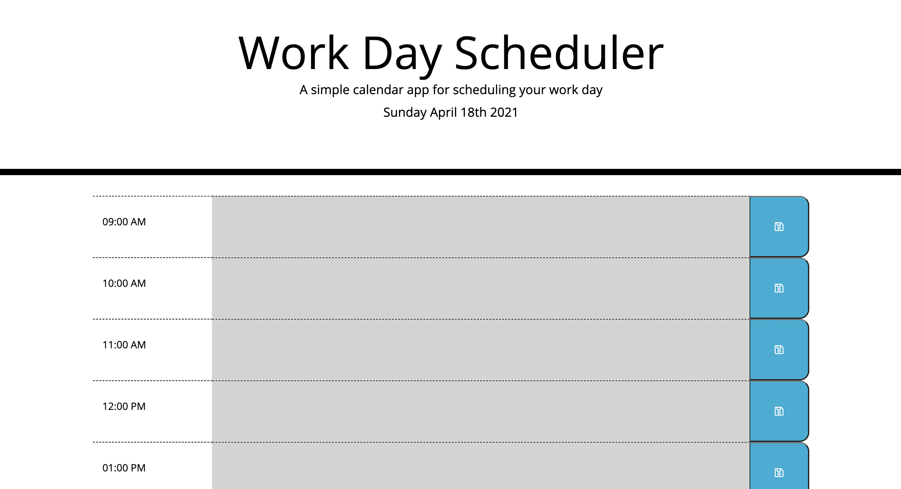
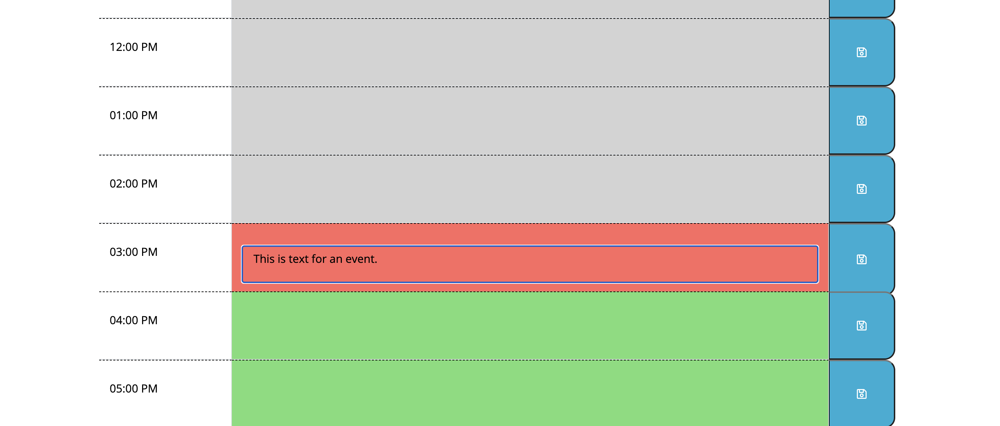
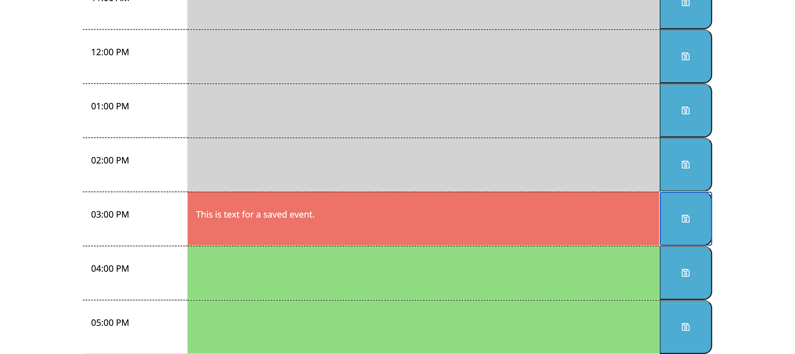

# super-disco
Daily Planner

## Website
https://mmgleave.github.io/super-disco/

## Description
A scheduler which displays the current date on the page and gives the user time blocks for 9AM-5PM. Allows the user to add one event to each time block using the save button. The user may also click on the existing event description to edit it and save it to update the event in local storage. The event descriptions persist when the page is refreshed.

## Screenshots

## Contribution
Made with ❤️ by Michelle Gleave
